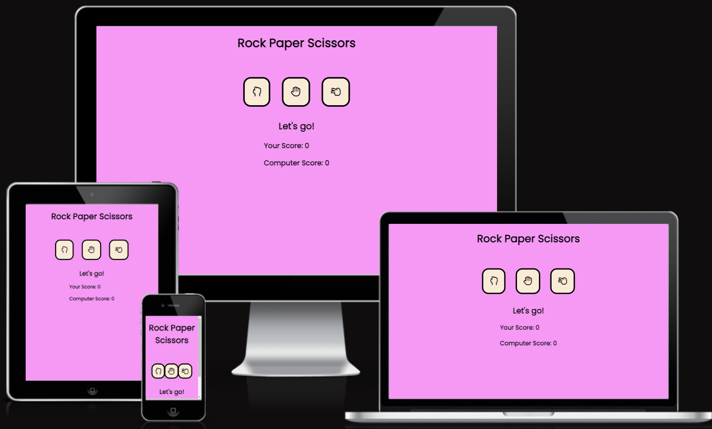
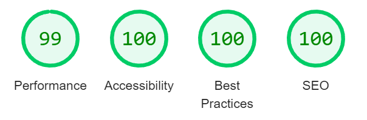

# Rock Paper Scissors
For this project I have created a site for a rock paper scissors game. This is a user vs computer game and has a randomly generated result for each button press so that this is always a fair game. The user can play a game of rock paper scissors with the computer and try to beat the computer.
 

 
# Features
 
## Header
The title of the game, Rock Paper Scissors, is large enough to read and clear to the user what game they are playing.
 

 
## Buttons
The three choices that the user can choose from. Rock, Paper or Scissors.
Using border radius so that they have a curved edge, a hover action and pointer so that when each button is hovered over they increase by size a small fraction and the mouse changes to a cursor. It is a way to highlight the user can interact with these buttons.
 

 
## Message
The H2 heading is the message part of the game. At the start the message will say "let's go!" to ready the user this is the start of the game. Every choice the user makes from this point onwards will change this message. If they win the round, if they draw with the computer or if the computer wins. There will be an appropriate message for the outcome.
 

 
## The result area
In this div there are two spans for the scores of either the user or the computer. Also have h3 heading to highlight the users score vs the computer's score text. This is laid out so it's easy to read and understand. The user will understand what score they have and also see the computers score.
 

 
# Future features
 Given more time I would like to add a max point reached feature, a message of who the overall winner was of the game and a restart game button.
 
# Testing
* Tested playing the game on Chrome and Firefox.
* Tested playing on a desktop, laptop and mobile device.
* Can confirm that the results are correct
* Can confirm that the font/color used is appropriate and I tested this by using lighthouse through dev tools.
* Can confirm that over all screen sizes that the site is responsive.
 
## Lighthouse Tests
 
Desktop
 

 
Laptop
 

 
Tablet
 

 
Mobile
 

 
## Bugs
### Solved
* When testing on dev tools to get the console to log the win, lose and draw function it wasn't showing up, I was expecting the console to log the "You won this round!" message but instead I wasn't seeing anything being logged. I realized that the functions were missing from my switch statements so for example, once I had placed the "win()" function under my case for the combinations to win, it would then show up on the console on dev tools.  
 
* I expected to see a number appear for the user’s score and I wasn't seeing any numbers because I had used the incorrect ID name. I also changed the variable thePlayersScore from const to let.
 
* My text for the user's score kept disappearing from the screen when the score result for the user was counting up. I expected to see the number increasing and the text to stay where it was placed, instead the text just vanished. After going back to my HTML I tried to put a span around the your-score id and the number 0, this has now fixed the problem and to make sure this doesn't happen to my computer score when I get round to creating that function I have put a span around the computer-score id and the number 0. I can now confirm that it all now works as expected.
 
 
## Validator Testing
* HTML - No errors found, passed on W3C HTML Validator
* CSS -  No errors found, passed on W3C CSS Validator (Jigsaw)
* JSHint - only warning that appears is "const is available in ES6 (use 'esversion: 6') or Mozilla JS extensions (use moz)".
 
## Unfixed Bugs
No unfixed bugs
 
# Deployment
The site was deployed to GitHub pages, the steps to deploy are as follows. First I started in the GitHub repository and navigated to the settings tab. From the settings tab scroll down to the pages tab. From source select deploy from a branch, then from branch select main branch. Once selected click save. The page will now provide the link to the complete website.
The live website link can be found here-[Rock Paper Scissors](https://8000-kjc-rockpaperscissor-4i5zgfwxuzc.ws-eu81.gitpod.io/)
 
# Credits
 
## Content
Code for Buttons and Event listeners used from Love Maths.
Favicon code used for how to insert into html came from Love Maths.
 
## Media
Button icons used was taken from FontAwesome - [FontAwesome](https://fontawesome.com/)
Favicon icon used was taken from Favicon.cc - [Favicon](https://www.favicon.cc/?action=icon&file_id=727175)